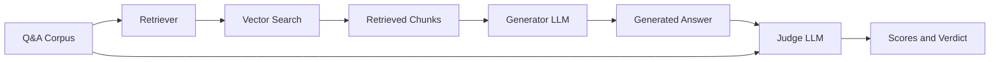
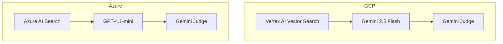

# System Architecture

## Overview

The BrightFox RAG Evaluation system tests retrieval-augmented generation quality by comparing generated answers against ground truth using an LLM-as-Judge approach.

## Data Flow

## Components

### 1. Q&A Corpus (`corpus/`)

The evaluation corpus contains **224 questions** derived from 40 source documents. Each question includes:

- **Question text** - The query to answer
- **Ground truth answer** - Human-verified correct answer
- **Source document** - Which document the answer comes from

### 2. Retriever (`src/retriever.py`)

Fetches relevant document chunks using vector similarity search.

| Platform | Service | Embedding Model |
|----------|---------|-----------------|
| GCP | Vertex AI Vector Search | gemini-embedding-001 (768 dim) |
| Azure | Azure AI Search | text-embedding-3-large (3072 dim) |

**Configuration:**

- **Top-K:** 12 chunks retrieved per query
- **Reranker:** Optional Vertex AI Ranking API

### 3. Generator LLM (`src/generator.py`)

Generates answers from retrieved context.

| Platform | Model |
|----------|-------|
| GCP | Gemini 2.5 Flash |
| Azure | GPT-4.1-mini |

### 4. Judge LLM (`src/judge.py`)

Evaluates generated answers against ground truth on 6 dimensions. Uses **Gemini 2.5 Flash** for both platforms to eliminate judge bias.

## Platform Comparison

## Directory Structure

| Directory | Purpose |
|-----------|---------|
| `src/` | Core reusable code (retriever, generator, judge) |
| `corpus/` | Q&A test corpus and document inventory |
| `scripts/` | Runnable evaluation scripts |
| `experiments/` | Test runs with results (gitignored, synced to GCS) |
| `reports/` | Polished comparison reports |
| `data/` | Source document chunks |

## GCP Resources

| Resource | Value |
|----------|-------|
| Project | `civic-athlete-473921-c0` |
| Location | `us-east1` |
| Vector Search Index | `eval_66` (65 docs, 6,059 chunks) |
| Embedding Model | `gemini-embedding-001` |
| LLM | `gemini-2.5-flash` |

## Azure Resources

| Resource | Value |
|----------|-------|
| Search Endpoint | `asosearch-stg.search.windows.net` |
| Search Index | `bf-demo` (55 docs, 8,691 chunks) |
| OpenAI Endpoint | `sponsored-eastus-oai.openai.azure.com` |
| Embedding Model | `text-embedding-3-large` |
| LLM | `gpt-4.1-mini` |
